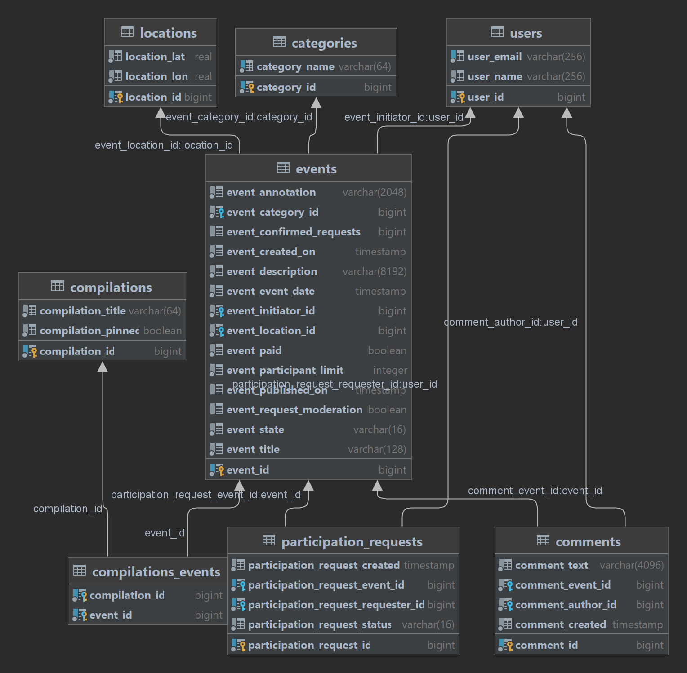
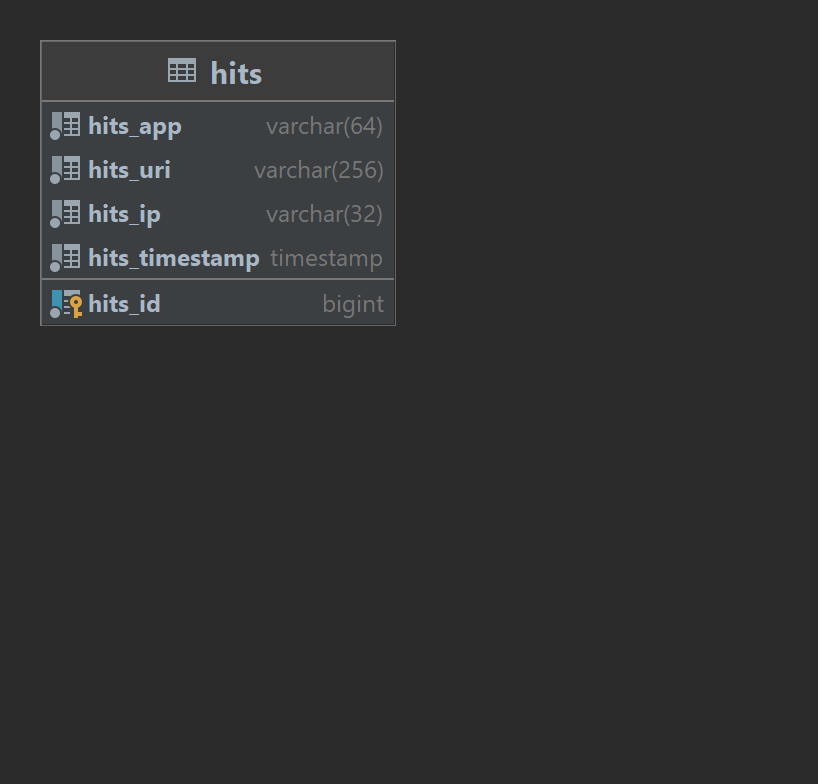

# Java-Explore-With-Me
Free time is a valuable resource. Every day we plan how to spend it - where and with whom to go. The most difficult thing in such planning is searching for information and negotiations. There are many details that need to be taken into account: what events are planned, whether friends are free at that moment, how to invite everyone and where to gather.

In this app you can propose any event from an exhibition to a trip to the cinema and gather a company to participate in it.

## Feature pull request
[feature_comments](https://github.com/Shjiwa/java-explore-with-me/pull/6)

## This app can:
  * Create, change, delete, get a **category**
  *  Adding, deleting, getting a **user**
  *  Create, edit, receive, search, reject/publish an **event**
  *  Adding, updating, deleting, receiving a **compilation of events**
  *  Adding, canceling, receiving **requests to participate** in an event
  *  Getting **statistics** on visits

## Modules
* **service**: Main module of the Explore With Me app
* **stats** Statistic service, it also has 3 submodules:
    * **client** Client for interacting with *stats server*
    * **common** *Data-Transfer-Objects* and constants for *stats server*
    * **server** Main statistics server, all logic is here

## API Specification
[stats](https://github.com/Shjiwa/java-explore-with-me/blob/main/ewm-main-service-spec.json
)

[ewm](https://github.com/Shjiwa/java-explore-with-me/blob/main/ewm-stats-service-spec.json)

## Database diagrams

### Explore With Me
<p align="center">
  
</p>

### Stats
<p align="center">
  
</p>

The application is written in Java. Sample code:
```java
public class Practicum {
    public static void main(String[] args) {
        System.out.println("Hello, world!");
    }
}
```
